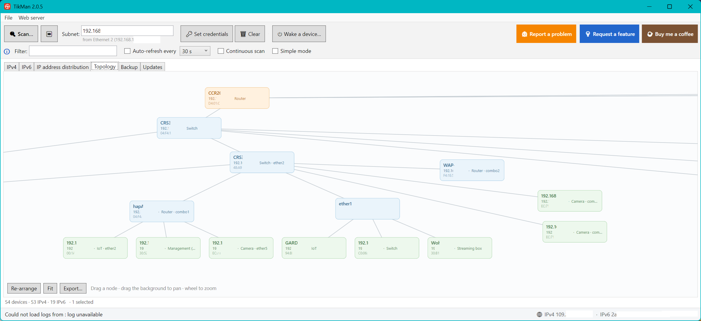
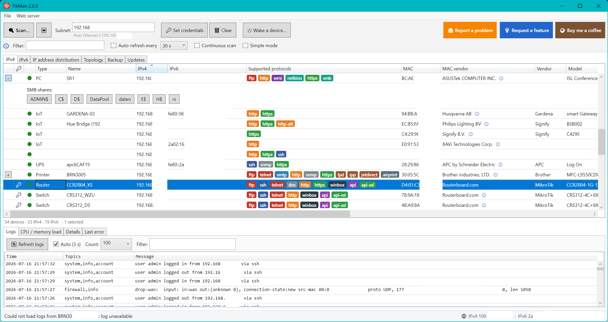

# TikMan

A Windows desktop tool (WPF, .NET 10) for managing and monitoring the devices on a LAN from
one place. It knows **MikroTik** (RouterOS v7) inside out and auto-discovers and classifies
**everything else** on the network too — switches, access points, firewalls, printers, NAS,
cameras, VoIP phones, IoT, UPS, PCs/servers and virtual machines — without you having to pick
protocols or ports: TikMan probes the services itself and figures out what each device is.

It doesn't reimplement RouterOS; it's a fast, convenient front-end over the REST API **and**
SSH for managing many devices at once — with a strong bias towards doing the secure thing by
default. Open source (MIT): **github.com/pgadient/TikMan**.



*The physical map: not "these 40 addresses answered", but **which switch port each device is
actually plugged into** — read from the bridge forwarding tables over RouterOS or plain SNMP.
Traceroute cannot see layer 2; the forwarding table can. Exportable as PNG or vector PDF.*

> ⚠️ **Disclaimer.** TikMan is developed with heavy AI assistance and tested against a real,
> mixed-vendor network — but not against every device out there. It is provided **without any
> warranty** ([LICENSE](LICENSE), MIT) and used **at your own risk**. Be especially careful
> with **"Install update"** and **"Backup"**, which reboot devices and export configurations:
> test first, verify your backups, and mind the ordering when doing bulk updates.

## Screenshots



*The device list. Each device is identified and classified — type, name, addresses, the services
it answers on, vendor and model — with the selected device's logs, CPU/memory and details
underneath. 🔑 marks the devices that have a login stored.*

## Highlights

- **Zero-config discovery.** Point it at your network and it finds and identifies devices over
  many channels at once — no manual protocol or port picking.
- **Multi-vendor, not just MikroTik.** Deep RouterOS support, plus solid identification and
  actions for the rest of the fleet.
- **Secure by default.** Credentials and config only ever travel over **HTTPS or SSH**. Plain
  HTTP is off unless you explicitly allow it — so nothing sensitive leaks over the wire.
- **A picture of your network.** Interactive logical and physical topology maps, exportable as
  PNG or true vector PDF.
- **Remote hands, built in.** SSH terminal and a VNC viewer inside the app, plus Wake-on-LAN.
- **Runs in your browser, too.** A built-in web server mirrors the whole app — including the
  SSH terminal and VNC — so you can manage the fleet from your phone. HTTPS-only for anything
  that touches a password or a screen.
- **Seven languages**, self-contained builds for x64 and ARM64, and quiet auto-updates.

## Features in detail

### Discovery & classification
- **Parallel discovery:** MikroTik MNDP (UDP 5678), a subnet ping/port scan, IPv6, **Zyxel ZON**
  (raw Ethernet, needs Npcap), **mDNS/Bonjour** and **UPnP/SSDP** for the devices that only name
  themselves that way (Apple gear, Smart-TVs, Sonos, Chromecast…), and **SNMP** for the physical
  topology.
- **Honest identification:** active probes first (web fingerprint / SNMP / WMI / model title),
  MAC-OUI only as a last resort — so a device looks the same locally and over a VPN. Recognises
  firewalls, switches, APs, printers/MFPs, VoIP phones and PBXs, cameras, NAS, payment terminals,
  franking machines, BMC/out-of-band controllers, and virtual machines (by hypervisor MAC range).
- **Simple/corporate mode:** a plain IPv4-only scan (ping + TCP) with none of the extra
  broadcasts/probes, for locked-down networks.

### Monitoring
- Auto-refresh (configurable) of CPU, RAM, uptime and version, with a per-device history chart.
- Reads happen over the **secure path first**: HTTPS REST → **SSH CLI** → HTTP only if you've
  allowed it. A RouterOS device whose HTTPS handshake is broken is still read — over SSH — instead
  of falling back to clear-text HTTP.

### Topology
- **Logical map** (IP-address distribution) and a **physical map** built from real evidence:
  RouterOS bridge forwarding tables (which switch port a MAC hangs off — the one thing traceroute
  can't see), **SNMP** FDB for non-MikroTik and login-less gear, `/ip neighbor`, and traceroute for
  routed hops. Tidy-tree layout, pan/zoom, port grouping.
- **Export** the whole graph as a PNG or a lossless **vector PDF**.

### Remote access
- **Built-in SSH terminal** (with the non-standard MAC handling some firewalls need) and an
  **embedded VNC viewer** (RFB 3.3/3.7/3.8).
- Clickable **RDP / VNC / RTSP** badges, **Wake-on-LAN**, and "open in WinSCP / PuTTY / VLC".

### Backups
- **Config export (.rsc):** the full text configuration, per device or for the whole fleet into
  one folder. Runs over **HTTPS**, and over **SSH (`/export`)** when HTTPS is broken — so it stays
  secure and works even on devices with a broken TLS stack. Files are named automatically
  (`<Identity/Board>_<IP>_<timestamp>.rsc`).
- **Full backup (.backup):** the exact binary image (including secrets, restorable on the same
  model/version), fetched **entirely over SSH** — create, download (SCP) and clean-up.

### Updates
- Update check across every device, per-device update channel (stable / long-term / testing /
  development), and an assistant that installs sequentially in a chosen order and waits for each
  device to come back online. *(Updates reboot devices — see the note below.)*

### Web server (optional)
- Toggle it from the **Web server** menu (off by default). It runs in-process and mirrors the app
  in a browser: live device list, scan control with progress, the topology map, per-device details,
  Wake-on-LAN, **set login**, **backup download**, an **SSH terminal** (xterm.js) and **VNC**
  (noVNC).
- **Security:** HTTP Basic auth is mandatory; every credential- or screen-bearing action
  (login, backup, terminal, VNC) is **HTTPS-only** and refused over plain HTTP. Bring your own
  certificate or let TikMan generate and cache a self-signed one. Built on a small `TcpListener`
  server (no admin, no extra runtime) so the framework-dependent builds stay slim.

### Language
- English, German, Swiss German, Spanish, Italian, French and Portuguese, switchable under
  **Settings (⚙️)** and effective immediately. First run follows the Windows display language.

## Structure

```
src/
  TikMan.Core   Logic: REST + SSH clients, discovery, classification, backup, storage (no UI)
  TikMan.App    WPF desktop UI, and the built-in web server (exe, AssemblyName = TikMan)
```

`Core` is deliberately UI-free so other front-ends (like the built-in web server) can sit on top
of the same logic.

## Device requirements (RouterOS v7)

TikMan reaches RouterOS over the **REST API** (`https://<device>/rest/…`) **and/or SSH** — both
encrypted. You don't have to choose: it prefers HTTPS, falls back to SSH when the HTTPS handshake
fails, and only uses plain HTTP if you turn that on in the settings.

1. **HTTPS (recommended):** enable `www-ssl` with a certificate (self-signed is fine on a LAN):
   ```
   /certificate add name=local common-name=local key-usage=key-cert-sign,crl-sign
   /certificate sign local
   /certificate add name=https common-name=router
   /certificate sign https ca=local
   /ip service set www-ssl certificate=https disabled=no
   ```
   SSH (port 22) is enabled out of the box and is enough on its own for monitoring, topology and
   backups if you'd rather not set up certificates.
2. **A dedicated API user** instead of `admin`:
   ```
   /user group add name=monitor policy=read,write,reboot,ssh,ftp,rest-api,test
   /user add name=monitor group=monitor password=<strong-password>
   ```
   - Monitoring / logs / topology / checking updates: `read`, plus `rest-api` (HTTPS) and/or `ssh`.
   - Config backup (.rsc): `write` (temporary export file) over HTTPS, or `ssh` for `/export`.
   - Full backup (.backup) over SSH: `ssh`, `ftp`.
   - Switching channels & installing updates: additionally `write`, `reboot`, `test`.

## Build & run

```powershell
dotnet build src\TikMan.App\TikMan.App.csproj -c Debug
dotnet run   --project src\TikMan.App

# Release single-file exe (self-contained – no .NET install needed on the target):
dotnet publish src\TikMan.App -c Release -r win-x64 --self-contained true `
  -p:PublishSingleFile=true -p:IncludeNativeLibrariesForSelfExtract=true `
  -p:EnableCompressionInSingleFile=true -o dist\release
```

Requires the **.NET 10 SDK**. Releases ship four variants: `win-x64` / `win-arm64`, each
self-contained (~65 MB, no runtime needed) or framework-dependent (`-fdd`, ~11 MB, needs the
.NET 10 Desktop Runtime). ZON discovery additionally needs **Npcap** (WinPcap-compatible mode);
it's detected at runtime and simply skipped if absent.

## Security & data storage

- **Credentials live in your profile,** not the repo: `%AppData%\TikMan\devices.json`.
- **Passwords are DPAPI-encrypted** and bound to your Windows account — the file can't just be
  copied to another PC/user; passwords are re-entered there.
- **Secure by default on the wire:** monitoring, topology, config export and backups use HTTPS or
  SSH. Plain HTTP (which sends credentials in clear text) is **off unless you enable it** in
  Settings → Connections; when it's off, devices that only answer over HTTP are simply skipped
  with a hint rather than silently leaking.
- **Nothing sensitive in the repo:** `.gitignore` excludes `devices.json`, exported backups
  (`*.rsc`, `*.backup`), and the local `.claude/` and `memory/` folders. Still run `git status`
  before your first push.
- **The web server** requires a username + password (Basic auth, stored DPAPI-encrypted) and
  keeps every password/screen action on HTTPS; device passwords are never handed out over the web.

## Note on bulk updates

Updates reboot the device, so the assistant works sequentially and in list order, waiting for each
device to come back before starting the next. Reorder with ▲/▼.

As a rule of thumb, put the **edge devices first (APs, switches) and the uplink router last** — but
it is a rule of thumb, not a law. Two things bend it:

- **CAPsMAN.** If your controller is set to carry its CAPs along (`upgrade-policy`), the controller
  goes **first** and pulls them up to its version. Upgrade a CAP ahead of its controller and it can
  come back on a version the controller won't provision. With `upgrade-policy=none` this doesn't
  apply — the controller leaves its CAPs alone.
- **The usual "you'll cut off the path" argument is weaker here**, because the assistant waits for
  each device to come back before moving on: once the router is up again, everything behind it is
  reachable again. That argument is about firing updates off blind.

## Releases (maintainer notes)

1. Bump `<Version>` in `src/TikMan.App/TikMan.App.csproj`.
2. Publish all four variants (`win-x64`/`win-arm64` × self-contained/`-fdd`) and name the assets
   exactly `TikMan-<version>-win-<arch>[-fdd].exe` — the in-app auto-updater matches on that name.
3. On GitHub → **Releases → Draft a new release**: tag `vX.Y.Z` (matching `<Version>`), write
   notes, attach the four exes. Binaries live in Releases, not in git.
4. The exes are **unsigned**, so SmartScreen shows an "unknown publisher" warning on first run
   (*More info → Run anyway*). Code signing would remove it but needs a paid certificate.
