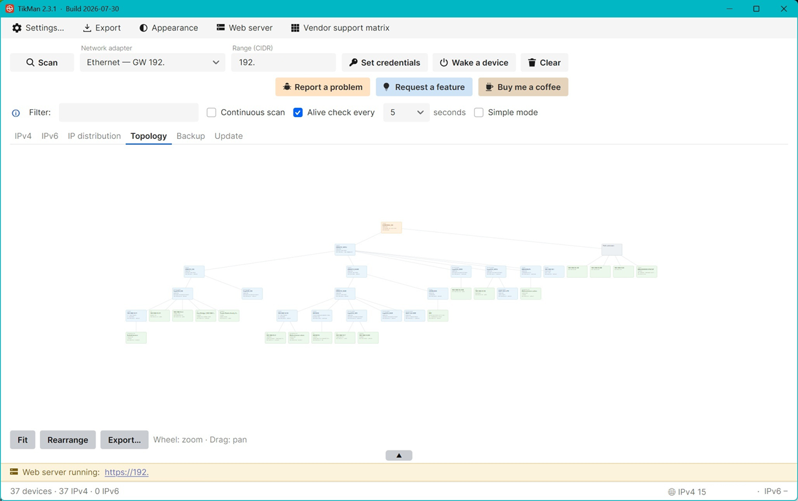
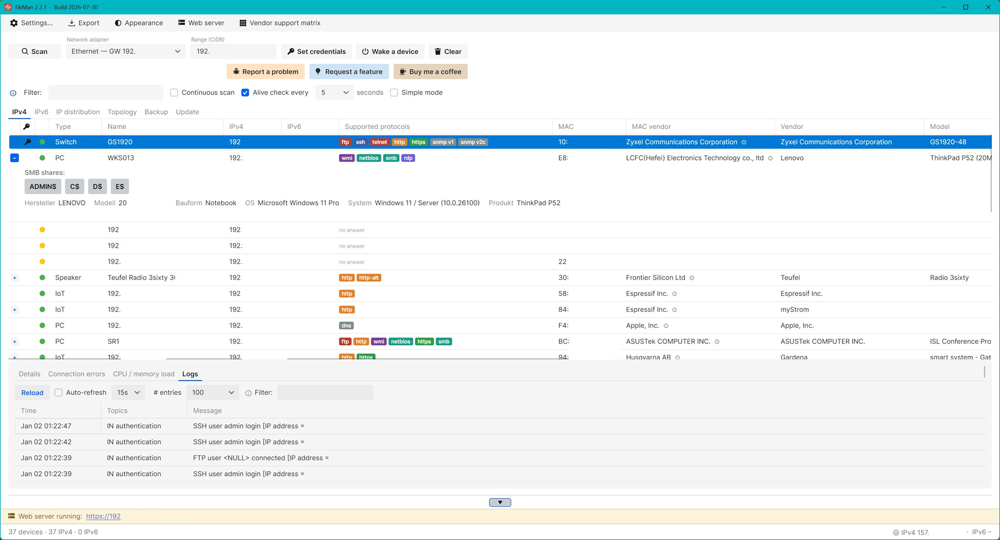

# TikMan

[](LICENSE)


Aim it at a network and TikMan finds every device, works out what each one is, and puts backups,
updates, SSH and VNC one click away — one portable file, no installation, native on Windows, Linux
and macOS.

A desktop tool (.NET 10) for watching over and managing the devices on a local network from one
place — **MikroTik** routers first and foremost, and, as well as it can, everything else it finds:
switches, access points, firewalls, printers, NAS, cameras, VoIP phones, IoT, UPS, PCs/servers and
virtual machines. You don't pick protocols or ports; it probes the usual services and tries to work
out what each device is.

It runs on **Windows** (the original and most-tested build) and, through a newer cross-platform
build, on **Linux and macOS**. The desktop app can also serve a web interface to a browser, and
there's a separate headless build for a server — that one does noticeably less than the full app.

It doesn't reimplement RouterOS — it's a front-end over the REST API **and** SSH for handling many
devices at once, with a bias towards doing the secure thing by default. Free and open source
([MIT](LICENSE)).



*The physical map: not "these 40 addresses answered", but **which switch port each device is plugged
into** — read from the bridge forwarding tables over RouterOS or plain SNMP. Traceroute can't see
layer 2; the forwarding table can. Exportable as PNG, vector PDF, draw.io or GraphML.*

> ⚠️ **Please read.** TikMan is a personal project built with heavy AI assistance and tested against
> one real, mixed-vendor network — not against every device out there, and the Linux/macOS builds are
> newer and less proven than the Windows one. It comes with **no warranty** ([LICENSE](LICENSE), MIT)
> and is used **at your own risk**. Be especially careful with **"Install update"** and **"Backup"**,
> which reboot devices and export configurations: test first, verify your backups, and mind the order
> when updating several devices.

## Screenshots



*The device list. Each device is identified and classified — type, name, addresses, the services it
answers on, vendor and model — with the selected device's logs, CPU/memory and details underneath.
🔑 marks the devices that have a login stored.*

## What it does

- **Discovery without configuration.** Point it at your network and it finds and identifies devices
  over several channels at once — no manual protocol or port picking.
- **MikroTik first, the rest as well as it can.** RouterOS gets the most complete support (monitoring,
  topology, Wi-Fi names, logs, backups, updates). Other vendors get identification and the actions
  that make sense for them — for example Zyxel and TP-Link switches can be monitored and backed up,
  while many devices are simply identified and classified.
- **Secure by default.** Credentials and config only ever travel over **HTTPS or SSH**. Plain HTTP is
  off unless you turn it on, so nothing sensitive goes over the wire in clear text.
- **Topology maps.** A logical map (address distribution) and a physical map built from real
  forwarding-table evidence, exportable as PNG, vector PDF, or editable **draw.io / GraphML** XML.
- **Remote access built in.** An SSH terminal and a VNC viewer inside the app, plus Wake-on-LAN.
- **A browser front-end, optionally.** The desktop app can serve a web version of itself — device
  list, scans, topology, SSH terminal and VNC — so you can reach the fleet from a phone. (A separate
  headless build exists for Linux/macOS servers, but it does much less.) Anything that touches a
  password or a screen is HTTPS-only.
- **Seven languages**, self-contained builds for Windows, Linux and macOS (x64 and ARM64), and a
  quiet update check.

## Download

Grab a build from **[Releases](https://github.com/pgadient/TikMan/releases)**. There's no installer —
it's a single file, and it doesn't write anything outside its own settings folder.

| Platform | File |
|---|---|
| **Windows** | `TikMan-<version>-win-x64.exe` or `-win-arm64.exe` — one self-contained file, nothing else to install |
| **Linux** | `TikMan-<version>-x86_64.AppImage` / `-aarch64.AppImage` — `chmod +x`, then run |
| **macOS** | `TikMan-<version>-macos.tar.gz` — unpack and run `install.command` (see the README inside; unsigned, so macOS needs one command to allow it) |

The Windows build is the one that's had the most use; the Linux and macOS builds are newer.

The Windows exes are **unsigned**, so SmartScreen shows an "unknown publisher" notice on first run
(*More info → Run anyway*). macOS blocks unsigned apps too — the bundled `install.command` clears the
quarantine flag for you.

Optional: **Npcap** (WinPcap-compatible mode) on Windows, or libpcap on Linux/macOS, adds Zyxel ZON
discovery. It's detected at runtime and skipped when absent — its licence means it can't be bundled.

## Features in detail

### Discovery & classification
- **Parallel discovery:** MikroTik MNDP, a subnet ping/port scan, IPv6 neighbours, **Zyxel ZON** (raw
  Ethernet, needs Npcap/libpcap), **mDNS/Bonjour** and **UPnP/SSDP** for devices that only name
  themselves that way (Apple gear, Smart-TVs, Sonos, Chromecast…), and **SNMP** (v1/v2c).
- **Identification, active probes first:** web fingerprint / SNMP / WMI / model title, with the
  MAC-OUI only as a last resort — so a device looks the same locally and over a VPN. It recognises
  firewalls, switches, APs, printers/MFPs, VoIP phones and PBXs, cameras, NAS, payment terminals,
  franking machines, BMC/out-of-band controllers, and virtual machines (by hypervisor MAC range). It
  errs towards leaving a device unlabelled rather than guessing "server" from a bare web port.
- **Simple mode:** a plain IPv4-only scan (ping + TCP) with none of the extra broadcasts/probes, for
  locked-down networks.

### Monitoring
- Auto-refresh (interval configurable) of CPU, RAM, uptime and version, with a per-device history
  chart. Works for RouterOS and, over SSH, for Zyxel and TP-Link switches.
- Reads take the **secure path first**: HTTPS REST → **SSH CLI** → HTTP only if you've allowed it. A
  RouterOS device whose HTTPS handshake is broken is still read — over SSH — rather than falling back
  to clear-text HTTP.

### Topology
- A **logical map** (IP-address distribution) and a **physical map** from real evidence: RouterOS
  bridge forwarding tables (which switch port a MAC hangs off — the thing traceroute can't see),
  **SNMP** FDB for non-MikroTik and login-less gear, `/ip neighbor`, and traceroute for routed hops.
  Tidy-tree layout, pan/zoom, port grouping.
- **Export** the whole graph as a PNG, a vector **PDF**, or editable **draw.io** / **GraphML** XML for
  a diagram editor.

### Remote access
- **Built-in SSH terminal** (with the non-standard MAC handling some firewalls need) and an
  **embedded VNC viewer** (RFB 3.3/3.7/3.8).
- Clickable **RDP / VNC / RTSP** badges, **Wake-on-LAN**, and "open in WinSCP / PuTTY / VLC".

### Backups
- **Config export:** the full text configuration, per device or for the whole fleet into one folder.
  RouterOS `.rsc` over HTTPS, or over **SSH (`/export`)** when HTTPS is broken; Zyxel switch `.cfg`
  over SSH. Files are named automatically.
- **Full backup (`.backup`, RouterOS):** the exact binary image, fetched **entirely over SSH** —
  create, download (SCP) and clean up.

### Updates
- An update check per device, a per-device update channel (stable / long-term / testing /
  development) for MikroTik, and an assistant that installs sequentially in a chosen order and waits
  for each device to come back online. For TP-Link and Zyxel, which have no update API, the "Latest"
  column instead links to the vendor's firmware page (with the newest version when it can be read).
  *(Updates reboot devices — test first.)*

### Web server (optional)
- Toggle it from the **Web server** menu (off by default). It runs in-process and mirrors the running
  app in a browser: live device list, scan control with progress, the topology map, per-device
  details, Wake-on-LAN, **set login**, **backup download**, an **SSH terminal** (xterm.js) and **VNC**
  (noVNC). (The standalone `TikMan.Host` build runs the same server without a desktop app, but exposes
  a smaller slice of this.)
- **Security:** HTTP Basic auth is mandatory; every credential- or screen-bearing action (login,
  backup, terminal, VNC) is **HTTPS-only** and refused over plain HTTP. Bring your own certificate or
  let TikMan generate and cache a self-signed one. It's a small `TcpListener` server — no admin, no
  extra runtime — so the framework-dependent builds stay slim.

### Language
- English, German, Swiss German, Spanish, Italian, French and Portuguese, switchable under
  **Settings (⚙️)** and effective immediately. First run follows the system display language.

## Structure

```
src/
  TikMan.Core          Logic: REST + SSH clients, discovery, classification, backup, storage (no UI)
  TikMan.App           WPF desktop UI for Windows (the original client)
  TikMan.App.Avalonia  Cross-platform desktop UI (Windows / Linux / macOS)
  TikMan.Web           Shared web UI + server layer
  TikMan.Host          Headless host that serves a limited subset of the web UI (Linux / macOS)
```

`Core` is deliberately UI-free so the desktop clients, the web server and the headless host all sit on
the same logic instead of reimplementing it. The two desktop UIs exist because the Avalonia one is
still catching up to the Windows one; the plan is to retire the WPF client once it has.

## Device requirements (RouterOS v7)

Nothing special. **SSH is enabled on RouterOS out of the box**, and it's enough on its own for
monitoring, topology, Wi-Fi names, logs, backups and updates — so a device with a login works as it
stands.

TikMan reaches RouterOS over the **REST API** (`https://<device>/rest/…`) **and/or SSH** — both
encrypted, and you don't have to choose. It prefers HTTPS, falls back to SSH when the HTTPS handshake
fails, and only uses plain HTTP if you switch that on yourself.

## Build & run

```powershell
# Windows desktop (WPF):
dotnet run --project src\TikMan.App

# Cross-platform desktop (Avalonia):
dotnet run --project src\TikMan.App.Avalonia

# Headless web host (Linux/macOS/Windows):
dotnet run --project src\TikMan.Host

# Release single-file exe (self-contained – no .NET install needed on the target):
dotnet publish src\TikMan.App.Avalonia -c Release -r win-x64 --self-contained true `
  -p:PublishSingleFile=true -p:IncludeNativeLibrariesForSelfExtract=true `
  -p:EnableCompressionInSingleFile=true -o dist\release
```

Requires the **.NET 10 SDK**. Linux/macOS packaging (AppImage, `.app`, tarball) lives under
[`packaging/`](packaging/); cutting a release is written down in [RELEASING.md](RELEASING.md).

## Security & data storage

- **Credentials live in your profile** — under `%AppData%\TikMan` on Windows, `~/.config/TikMan` on
  Linux, `~/Library/Application Support/TikMan` on macOS.
- **Passwords are encrypted at rest:** DPAPI (bound to your Windows account) on Windows, and AES with
  a local key file on Linux/macOS. Copied to another machine, the passwords don't come along — they're
  re-entered there.
- **Secure by default on the wire:** monitoring, topology, config export and backups use HTTPS or SSH.
  Plain HTTP (which would send credentials in clear text) is **off unless you enable it** in
  Settings → Connections; when it's off, devices that only answer over HTTP are skipped with a hint
  rather than silently leaking.
- **The web server** requires a username + password (Basic auth, stored encrypted) and keeps every
  password/screen action on HTTPS; device passwords are never handed out over the web.
